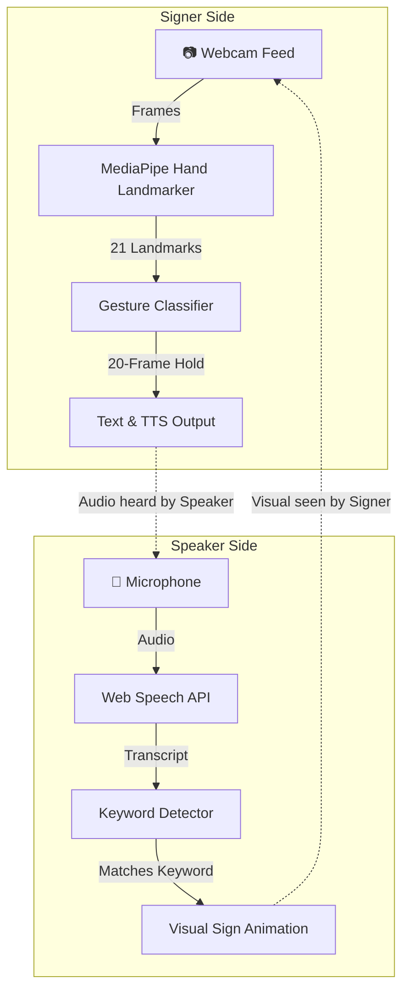

<div align="center">

# 🔗 LINK: Bridging the Communication Gap

**A Real-Time, Bi-Directional Sign Language Translation Interface**

[](https://react.dev/)
[](https://vitejs.dev/)
[](https://developers.google.com/mediapipe)
[](https://tailwindcss.com/)
[](https://opensource.org/licenses/MIT)

[Features](#-features) • [How It Works](#-how-it-works) • [Supported Gestures](#-supported-gestures) • [Installation](#-getting-started) • [Architecture](#-architecture-notes)

</div>

---

## 🌟 Introduction

**LINK** is an innovative, assistive communication web application designed to create a seamless, real-time conversation channel between sign language users and hearing individuals. 

Communication barriers often exist because standard video calls do not interpret sign language, and hearing users may not know sign language. LINK solves this by providing a bi-directional translation layer directly in the browser.

### The Two-Way Bridge

| User Role | Interface | Underlying Technology |
|:----------|:----------|:----------------------|
| **Signer** (User 1) | Signs naturally in front of their webcam. | **MediaPipe Hand Tracking** detects 21 hand landmarks. A custom algorithm classifies the gesture and converts it to text and spoken audio. |
| **Speaker** (User 2) | Speaks naturally into their microphone. | **Web Speech API** continuously transcribes speech. A keyword engine detects intent and displays corresponding visual animations/signs. |

---

## ✨ Features

### 🖐️ For the Signer (Hand Tracking → Speech)
- **Real-Time Hand Tracking:** Utilizes GPU-accelerated MediaPipe Hand Landmarker to detect a 21-point hand skeleton with minimal latency.
- **Robust Gesture Classification:** Custom finger-state logic (checking which fingers are extended or closed) translates physical hand shapes into conversational phrases.
- **Flicker-Free Interpretation:** A built-in 20-frame stability counter ensures gestures are intentionally held before triggering, eliminating accidental or noisy detections.
- **Text-to-Speech (TTS):** Detected signs are automatically spoken aloud using the browser's SpeechSynthesis API, allowing the other user to hear the intended message.

### 🎤 For the Speaker (Speech → Visual Animation)
- **Continuous Speech Recognition:** Leverages the Web Speech API to transcribe spoken words into text in real-time, handling both interim and final results.
- **Smart Keyword Detection:** The engine scans for specific conversational keywords in newly spoken text, ensuring animations trigger accurately even during long sentences.
- **Visual Sign Interpreter:** Displays animated emojis and progress bars to visually communicate the spoken words back to the signer.
- **VoiceOrb Visualizer:** A dynamic, microphone-reactive UI element powered by the Web Audio API that pulses with the speaker's volume.

### 🖥️ Application UI/UX
- **Focus Mode:** Expands the signer's video feed to full-screen while keeping the speaker's tools in a sleek floating Picture-in-Picture (PiP) overlay.
- **Live Transcript:** A scrolling terminal-like footer displaying the live conversation transcript.
- **Developer Console:** Real-time metrics showing tracking FPS and active landmark counts.

---

## 🎬 How It Works (Data Flow)



---

## 🤟 Supported Gestures Library

The current gesture classifier supports the following hand shapes:

| Intent | Hand Shape / Action | Translated Output |
|:-------|:--------------------|:------------------|
| **Hi / Hello** | All 5 fingers extended (open palm) | `"Hi / Hello"` |
| **How Are You?** | Index, Middle, Ring extended; Thumb & Pinky closed | `"How Are You?"` |
| **Nice To Meet You**| 4 fingers extended; Thumb closed | `"Nice To Meet You"` |
| **Sorry / Please** | Thumb, Index, Middle extended; Ring & Pinky closed | `"Sorry / Please"` |
| **Help Me** | Thumb & Middle extended; others closed | `"Help Me"` |
| **I Love You** | Thumb, Index, Pinky extended; Middle & Ring closed | `"I Love You"` |
| **Call Me** | Thumb & Pinky extended (shaka sign) | `"Call Me"` |
| **Victory / Peace** | Index & Middle extended (V sign) | `"Victory / Peace"` |
| **Good / Thank You**| Only Thumb extended (thumbs up) | `"Good / Thank You"` |
| **What? / One Moment**| Only Index extended (pointing up) | `"What? / One Moment"` |
| **Rock On** | Index & Pinky extended | `"Rock On"` |
| **Yes / Agree** | All fingers closed (fist) | `"Yes / Agree"` |

---

## 🗣️ Speech Keywords Dictionary

The system actively listens for the following keywords to trigger visual animations for the signer:

- **Greetings:** `hello`, `hi`, `goodbye`, `bye`, `good morning`, `good night`, `how are you`, `nice to meet`
- **Responses:** `thank you`, `thanks`, `sorry`, `please`, `yes`, `no`, `okay`, `good`, `great`
- **Feelings:** `happy`, `sad`, `hungry`, `tired`, `pain`
- **Needs:** `help`, `stop`, `wait`, `water`, `food`, `medicine`, `toilet`, `phone`

---

## 🚀 Getting Started

### Prerequisites
- **Node.js** (v18 or higher recommended)
- A modern web browser with Web Speech API support (Google Chrome or Microsoft Edge recommended)
- A functional **webcam** and **microphone**

### Installation

1. **Clone the repository:**
   ```bash
   git clone https://github.com/your-username/link-app.git
   cd link-app/my-project
   ```

2. **Install dependencies:**
   ```bash
   npm install
   ```

3. **Start the development server:**
   ```bash
   npm run dev
   ```
   *The application will be available at `http://localhost:5173`.*

### Build for Production
To generate a production-ready build:
```bash
npm run build
npm run preview
```

---

## ⚙️ Architecture Notes

- **Performance:** Hand tracking is delegated to the GPU (`delegate: "GPU"`) via MediaPipe's WebAssembly (WASM) backend, ensuring smooth 30+ FPS operation even on standard laptops.
- **Debouncing & Stability:** The `consecutiveSignCountRef` algorithm requires exactly 20 consecutive identical frames before confirming a gesture, acting as a robust low-pass filter against tracking jitter.
- **Smart String Scanning:** To prevent infinite loops with the Web Speech API (which accumulates all spoken text into a single string), the `scannedUpToRef` pointer ensures that the keyword engine only evaluates *newly spoken* words.

---

## 🔮 Future Roadmap

- [ ] **Real Sign Language Assets:** Replace placeholder emojis with high-quality Indian Sign Language (ISL) or American Sign Language (ASL) GIF/video loops.
- [ ] **Multi-Hand Tracking:** Implement logic to combine states from both left and right hands for complex signs.
- [ ] **Localization:** Add support for Hindi (`hi-IN`) and other regional languages for Speech-to-Text and TTS.
- [ ] **Dynamic Dictionary:** Allow users to add custom gestures and bind them to specific phrases via an intuitive UI.

---

## 🤝 Contributing

Contributions are welcome! Whether it's adding new gestures, improving the UI, or fixing bugs:
1. Fork the Project
2. Create your Feature Branch (`git checkout -b feature/AmazingFeature`)
3. Commit your Changes (`git commit -m 'Add some AmazingFeature'`)
4. Push to the Branch (`git push origin feature/AmazingFeature`)
5. Open a Pull Request

---

## 📄 License

Distributed under the MIT License. See `LICENSE` for more information.

---

<div align="center">
  <b>Built with ❤️ to make digital communication accessible for everyone.</b>
</div>
# link

# link.k

# link

